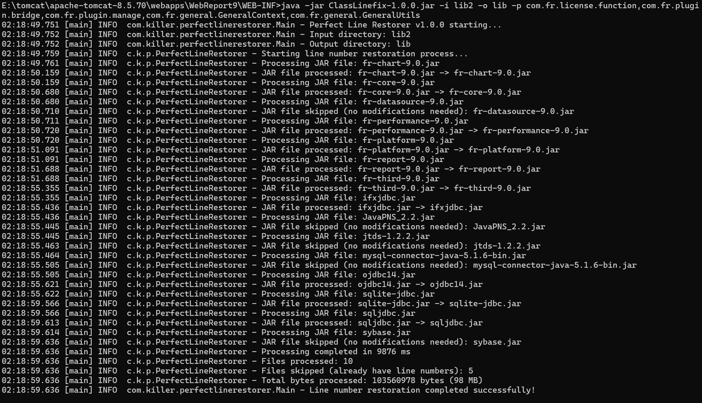
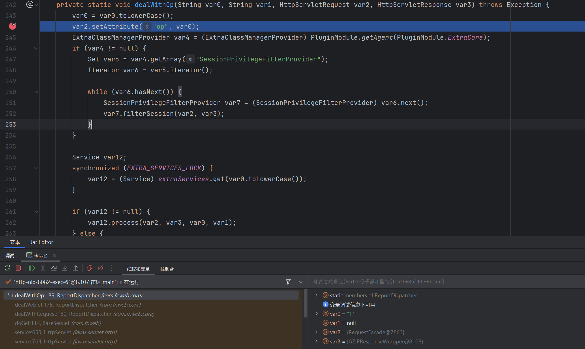

# ClassLinefix

一个专业的Java字节码行号恢复工具，可以为字节码添加顺序行号，使得调试和异常堆栈跟踪更加清晰。


## 特性

### 🚀 核心功能
- **智能行号恢复**: 集成多种策略，自动选择最适合的方法
- **批量处理**: 支持JAR和CLASS文件的批量处理
- **目录结构保持**: 输出文件保持与输入相同的目录结构
- **重复处理检测**: 自动检测已有行号信息，避免重复处理


## 使用方法

### 基本用法
```bash
java -jar ClassLinefix.jar -i <输入目录> -o <输出目录>
```

### 命令行选项
```
usage: java -jar ClassLinefix.jar
  -h,--help                      显示帮助信息
  -i,--input <directory>         包含JAR和CLASS文件的输入目录
  -o,--output <directory>        处理后文件的输出目录
  -p,--packages <package1,package2,...>  排除指定包名或类名的处理（逗号分隔）
  -s,--skip-inner <true|false>   跳过内部类和包含内部类的类（默认：false）
```

### 使用示例

#### 基本用法
```bash
# 处理所有文件
java -jar ClassLinefix.jar -i ./input-jars -o ./output-jars
```

#### 排除包含内部类的文件
```bash
# 跳过内部类
java -jar ClassLinefix.jar -i ./input-jars -o ./output-jars -s true
```

#### 排除特定包
```bash
# 排除指定包的处理
java -jar ClassLinefix.jar -i ./input-jars -o ./output-jars -p "com.example.exclude,org.test"
```

#### 复合选项使用
```bash
# 跳过内部类且排除特定包
java -jar ClassLinefix.jar -i ./input-jars -o ./output-jars -s true -p "com.obfuscated"
```


## 配置选项详解

### 内部类处理 (`--skip-inner`)
- **默认值**: `false`
- **作用**: 控制是否处理内部类和包含内部类的外部类

### 包排除 (`--packages`)
- **格式**: 逗号分隔的包名或类名列表
- **支持模式**:
  - 完整类名: `com.example.MyClass`
  - 包名前缀: `com.example`（会排除该包下所有类）
- **使用场景**: 排除已知有问题的包或不需要调试的第三方库

### 输入输出目录
- **输入目录** (`--input`): 包含JAR和CLASS文件的源目录
- **输出目录** (`--output`): 处理后文件的目标目录
- **目录结构**: 输出目录会完全保持输入目录的结构

## 工作原理

### 处理流程
1. **扫描输入目录**: 递归查找所有JAR和CLASS文件
2. **文件分析**: 检查每个文件是否已包含行号信息
3. **内部类检测**: 根据配置决定是否跳过内部类和包含内部类的文件
4. **包过滤**: 检查文件是否在排除包列表中
5. **策略选择**: 根据文件特征自动选择最适合的恢复策略
6. **行号恢复**: 应用选定的策略添加行号信息
7. **结构保持**: 在输出目录中重建相同的目录结构

### 安全性和兼容性
- **已有行号检测**: 自动跳过已包含行号信息的文件
- **智能过滤**: 内部类检测和包排除机制
- **字节码完整性**: 确保不破坏原始字节码的逻辑结构
- **跳转目标保护**: 智能处理现有的标签和跳转指令，避免破坏控制流
- **内部类安全**: 可选的内部类跳过机制，避免处理复杂的嵌套结构
- **错误恢复**: 处理失败时保持原始文件不变


## 常见问题


**Q: 处理后的JAR文件无法运行**

A: 通过报错确认具体是哪些类存在问题，可暂时使用-p参数排除这些类。

**Q: 某些代码依然没有行号信息**

A: 静态代码块没有添加行号信息

**Q: 某些文件被跳过**

A: 工具会自动跳过已包含行号信息的文件，这是正常行为。

**Q: 程序一直循环卡死**

A: 输出目录不能为输入目录的子目录

**Q: 调试时有时会乱跳行号**

A：行号恢复不能完美复原

# 帆软行号恢复

未恢复行号前帆软不能正常调试

只能打方法断点，行断点显示不可用

将工具复制到帆软的`WEB-INF`下，重命名lib为lib2然后执行下面命令

```bash
java -jar ClassLinefix-1.0.0.jar -i lib2 -o lib -p com.fr.license.function,com.fr.plugin.bridge,com.fr.plugin.manage,com.fr.general.GeneralContext,com.fr.general.GeneralUtils
```
此处必须设置`-p`排除某些类才行


默认为INFO输出详细日志在log目录下


使用恢复行号后的jar运行程序，然后将恢复行号的lib加入idea依赖可以看到成功断点
